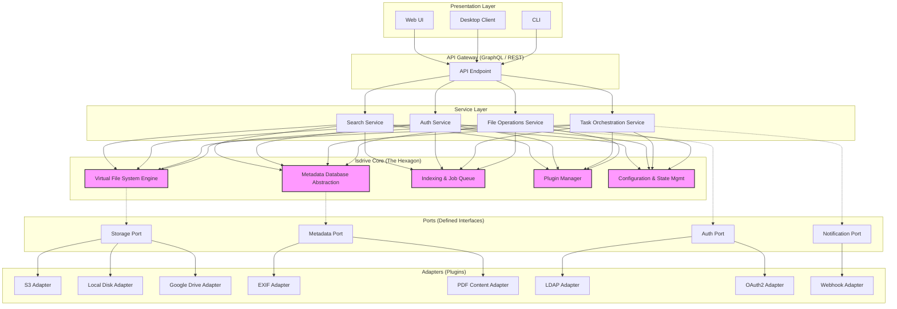

# lsdrive

**lsdrive: 开源、高性能的统一文件管理系统**

---

## 摘要

lsdrive 通过虚拟化文件系统，为分散在本地磁盘、网络存储和云服务中的数字资产提供统一的管理接口。

## 软件架构

架构核心为六边形模式（端口与适配器），旨在实现最大化的模块化、可测试性与可扩展性。

### 核心组件

*   **lsdrive 核心 (Hexagon)**: Rust 实现的业务逻辑核心。
    *   **VFS 引擎**: 提供统一的、后端无关的文件树抽象。
    *   **元数据数据库抽象**: 定义元数据存储与查询接口。
    *   **索引与作业队列**: 异步处理文件扫描、元数据提取等耗时任务。
    *   **插件管理器**: 负责插件的发现、加载与生命周期管理。
*   **服务层**: 编排核心组件以实现具体应用功能。
*   **端口 (Ports)**: 核心内部定义的功能接口 (Rust Traits)。
*   **适配器 (Adapters)**: 端口的具体实现，作为插件连接外部服务。
*   **表示层**: 用户交互入口，包括 WebUI, 桌面客户端, CLI。

## 项目路线图

### 阶段一: 基础框架 (Q3 2025 - Alpha)
**目标**: 验证核心架构，交付最小可用产品（MVP），构建稳定开发基础。
*   `[ ]` **[C-01]** VFS 引擎
*   `[ ]` **[C-02]** SQLite 元数据后端
*   `[ ]` **[C-04]** 插件管理器
*   `[ ]` **[A-01]** 核心 GraphQL API
*   `[ ]` **[P-01]** 存储插件：本地文件系统, WebDAV, S3
*   `[ ]` **[I-01]** 建立 CI/CD 流水线

### 阶段二: 功能扩展 (Q4 2025 - Beta)
**目标**: 扩展核心功能，发布图形界面，引入安全特性。
*   `[ ]` **[C-05]** 持久化作业队列
*   `[ ]` **[C-06]** 零知识加密框架
*   `[ ]` **[S-01]** 高级搜索服务
*   `[ ]` **[S-02]** 本地用户认证
*   `[ ]` **[P-04]** 存储插件：Google Drive, Dropbox
*   `[ ]` **[P-05]** 元数据插件：EXIF, ID3
*   `[ ]` **[U-01]** 发布 Web UI
*   `[ ]` **[U-02]** 发布 Tauri 桌面客户端

### 阶段三: 稳定生态 (Q1 2026 - v1.0)
**目标**: 实现生产级稳定性，完善文档，健全插件生态。
*   `[ ]` **[C-07]** 性能调优与基准测试
*   `[ ]` **[C-08]** 稳定插件 API v1.0
*   `[ ]` **[S-03]** RBAC 权限模型
*   `[ ]` **[P-06]** 认证插件：LDAP, OAuth2 (OIDC)
*   `[ ]` **[D-01]** 发布用户与管理员文档
*   `[ ]` **[D-02]** 发布插件开发指南
*   `[ ]` **[I-02]** 发布官方 Docker 镜像

### 阶段四: 高级功能 (Q2 2026+)
**目标**: 引入协作、自动化与移动端支持。
*   `[ ]` **[F-01]** 文件/目录共享
*   `[ ]` **[F-02]** 元数据协作编辑
*   `[ ]` **[F-03]** 自动化规则引擎
*   `[ ]` **[F-04]** 开发 iOS/Android 客户端
*   `[ ]` **[F-05]** 设计实例联合协议

## 贡献

欢迎任何形式的贡献。
*   **报告 Bug**: 通过 GitHub Issues 提交。
*   **功能建议**: 在 GitHub Discussions 中发起讨论。
*   **代码贡献**: 请阅读 **CONTRIBUTING.md** 后提交 Pull Request。

## 许可证

[MIT](./LICENSE)
